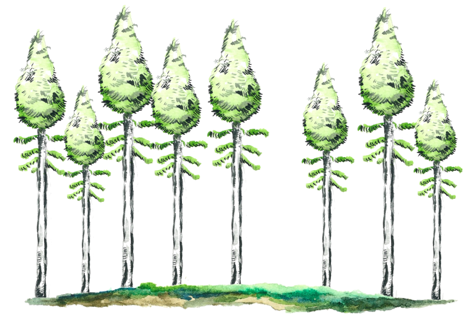

```{r setup, include=FALSE}
knitr::opts_chunk$set(echo = TRUE)

library("shiny")
library("tuneR")
library("markdown")
```

## Avant le stade de vieille for?t: la for?t ?quienne

```{r schema, echo=FALSE, fig.cap="*Repr?sentation sch?matique d'une for?t bor?ale ?quienne*", out.width = '50%'}

```


* Les perturbations naturelles les plus violentes, par exemple les feux de for?ts, causent souvent la mort de l'ensemble des arbres des for?ts affect?es

* Suite ? de telles perturbations, les graines d'esp?ces d'arbres adapt?es ? de tels ph?nom?nes s'?tablissent et germent dans ces peuplements d?sormais totalement libres de toute concurrence. Leur croissance est donc souvent forte.

* Tous ces nouveaux arbres apparaissent ? peu pr?s en m?me temps ; ils ont ainsi tous le m?me ?ge. On utilise alors le terme ? ?quien ? pour d?signer ce type de for?t. Nous ne sommes donc pas encore dans des vieilles for?ts.


*Dans les extraits audio pr?sent?s ici, nous pouvons entendre que toutes les m?lodies individuelles commencent dans les premi?res secondes et sont domin?es par des notes aigues. Cela indique donc que tous ces arbres sont apparus en m?me temps et profitent de l'absence de concurrence pour pousser le plus vite possible. Il s'agit donc de for?ts ?quiennes.*

**Exemple de for?t ?quienne n1**

```{r , echo = FALSE}
setwd("F:/Enregistrement/Musique_vieilles_forets/Test_site/test_foret")

tags$audio(src = "Debut_foret_ancienne_1.wav", type = "audio/wav", controls = NA)
```


**Exemple de for?t ?quienne n2**

```{r , echo = FALSE}
setwd("F:/Enregistrement/Musique_vieilles_forets/Test_site/test_foret")

tags$audio(src = "Debut_foret_ancienne_2.wav", type = "audio/wav", controls = NA)
```

